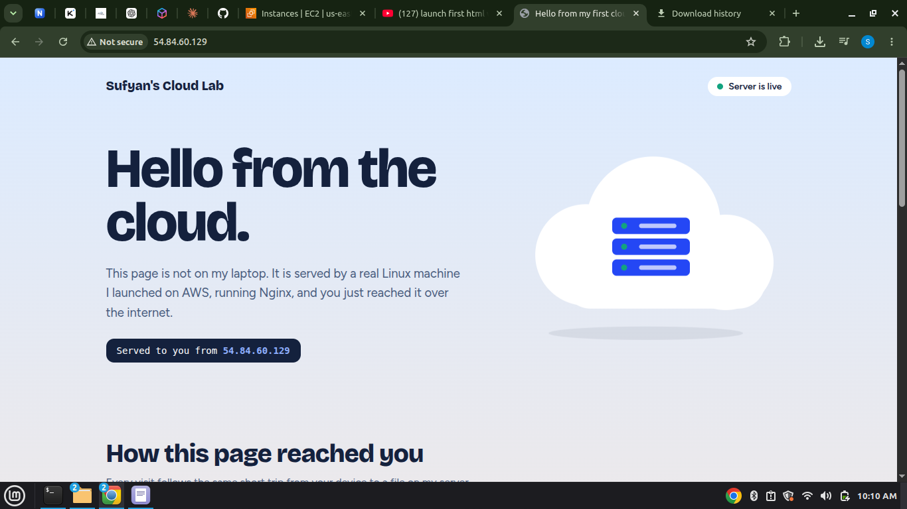
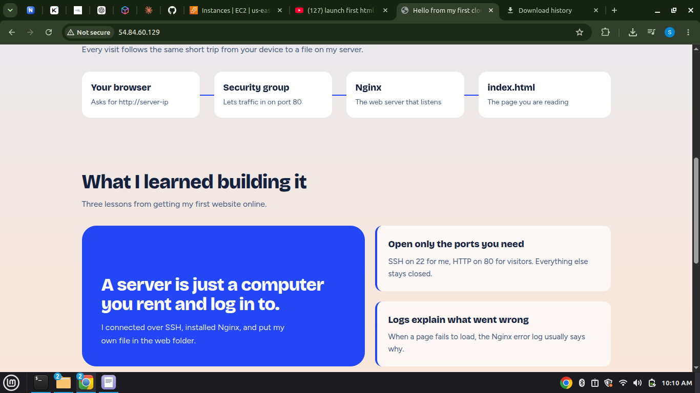
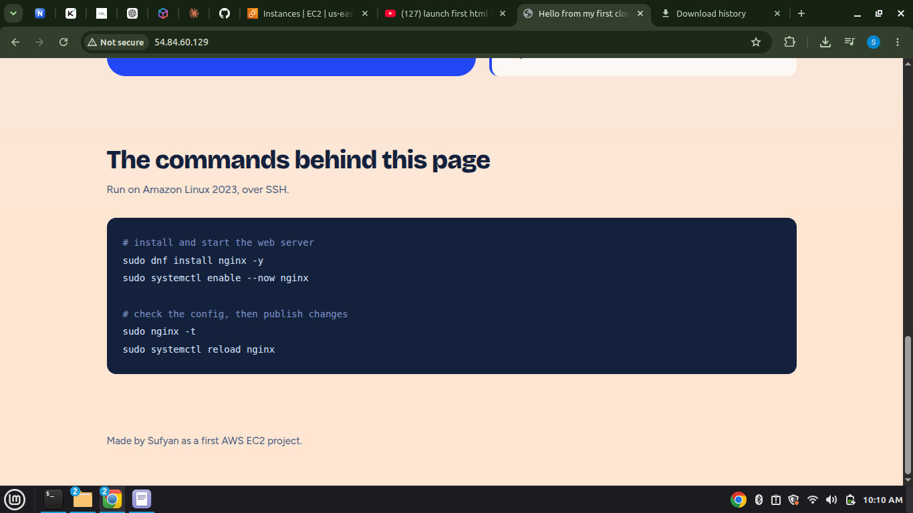

# My First EC2 Website

A static HTML/CSS website hosted on an **AWS EC2** instance, served by **Nginx** on **Amazon Linux 2023**. This project documents every step I followed, from launching the server to seeing my page live in the browser.

## Screenshot





## How it works

```
Your browser  -->  Security group (port 80)  -->  Nginx  -->  index.html
                   Port 22 (SSH) is used only by me to log in and upload files
```

| Part | What it does |
|---|---|
| EC2 instance | A virtual Linux server rented from AWS |
| Security group | A firewall that decides which ports are open |
| Port 22 (SSH) | Lets me log in to the server and copy files to it |
| Port 80 (HTTP) | Lets visitors load the website |
| Nginx | The web server software that serves `index.html` |

## Tech stack

- AWS EC2 (free-tier instance, t2.micro or t3.micro)
- Amazon Linux 2023
- Nginx
- HTML and CSS
- SSH and SCP from a Linux Mint terminal

## Project structure

```
ec2-first-website/
├── index.html
├── images/
│   └── screenshot.png
├── .gitignore
└── README.md
```

## Step-by-step guide

Replace `YOUR_PUBLIC_IP` with the instance's public IPv4 address and `your-key.pem` with your own key file.

### 1. Launch the EC2 instance

1. In the AWS console open **EC2 > Launch instance**.
2. Give it a name, choose the **Amazon Linux 2023** AMI and a free-tier type (t2.micro or t3.micro).
3. Create or choose a **key pair** (.pem file) and keep it safe.
4. Under Network settings click **Edit** and set **Auto-assign public IP** to **Enable**.
5. Click **Launch instance** and wait until the state is **Running** and status checks show **2/2 passed**.

### 2. Configure the security group

Add these inbound rules:

| Type | Port | Source |
|---|---|---|
| SSH | 22 | My IP |
| HTTP | 80 | Anywhere (0.0.0.0/0) |

Without the HTTP rule, the website will not open in a browser even if Nginx is running.

### 3. Connect to the instance over SSH

On my own computer's terminal:

```bash
chmod 400 your-key.pem
ssh -i your-key.pem ec2-user@YOUR_PUBLIC_IP
```

`chmod 400` is required, otherwise SSH rejects the key as "too open". Type `yes` at the fingerprint question. The prompt changes to `[ec2-user@ip-172-... ~]$` when I am inside the server.

### 4. Install and start Nginx

Run these inside the EC2 terminal:

```bash
sudo dnf update -y
sudo dnf install nginx -y
sudo systemctl start nginx
sudo systemctl enable nginx
sudo systemctl status nginx
```

Status should show `active (running)`. Press `q` to exit.

### 5. Check the default page

Open `http://YOUR_PUBLIC_IP` in a browser (use `http://`, not `https://`). The Nginx welcome page confirms the server and port 80 work.

### 6. Upload my website

In a **new terminal on my own computer** (not the SSH one):

```bash
scp -i your-key.pem index.html ec2-user@YOUR_PUBLIC_IP:~/
```

The `:~/` at the end is required. It tells `scp` to copy to the server's home folder. Success prints `index.html ... 100%`.

### 7. Publish it

Back in the EC2 terminal:

```bash
sudo mv ~/index.html /usr/share/nginx/html/index.html
sudo chmod 644 /usr/share/nginx/html/index.html
sudo nginx -t
sudo systemctl reload nginx
```

`nginx -t` must report that the syntax is ok and the test is successful.

### 8. View the live website

Open `http://YOUR_PUBLIC_IP` and hard refresh with `Ctrl+Shift+R`. The new page replaces the default Nginx page.

## Command reference

| Command | Meaning |
|---|---|
| `sudo dnf update -y` | Updates installed packages |
| `sudo dnf install nginx -y` | Installs the Nginx web server |
| `sudo systemctl start nginx` | Starts Nginx now |
| `sudo systemctl enable nginx` | Starts Nginx automatically after reboot |
| `sudo systemctl status nginx` | Shows whether Nginx is running |
| `sudo nginx -t` | Tests the Nginx configuration |
| `sudo systemctl reload nginx` | Applies changes without downtime |
| `ls -la /usr/share/nginx/html/` | Lists the website files |
| `sudo tail -f /var/log/nginx/error.log` | Live view of Nginx errors |
| `sudo ss -tulpn` | Shows which ports the server is listening on |
| `whoami` | Shows the current user (`ec2-user`) |

## Troubleshooting

| Problem | Fix |
|---|---|
| Browser keeps loading or times out | Add the HTTP (port 80) rule to the security group |
| `Permission denied (publickey)` | Wrong key file or username. Use `ec2-user` for Amazon Linux |
| `UNPROTECTED PRIVATE KEY FILE` | Run `chmod 400 your-key.pem` |
| `scp` prints nothing and no upload happens | The destination is missing `:~/` at the end |
| Old page still shows | Hard refresh with `Ctrl+Shift+R` |
| `403 Forbidden` | Run `sudo chmod 644 /usr/share/nginx/html/index.html` |
| Public IP changed | Stopping and starting an instance changes it unless an Elastic IP is attached |
| Status checks not completing | Wait a few minutes, then reboot, or stop and start the instance |

## Cleanup

To avoid charges after practicing, stop or terminate the instance from the EC2 console and release any Elastic IP.

## Security note

Never upload your `.pem` key file to GitHub. This repository's `.gitignore` blocks `*.pem` files.

## What I learned

- A server is a computer I rent and log in to over SSH.
- Port 22 is for administration, port 80 is for visitors, and the security group controls both.
- Nginx serves files from `/usr/share/nginx/html/`.
- Logs and `nginx -t` help find problems quickly.

## Author

Sufyan
